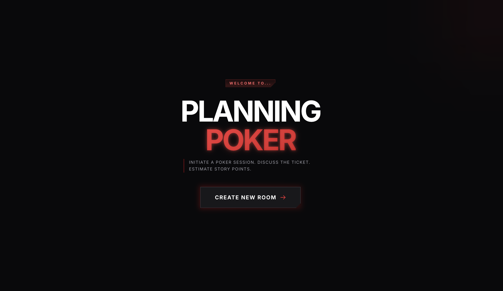
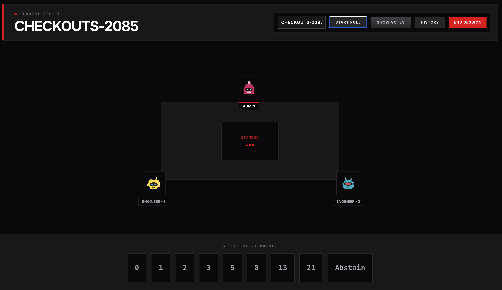
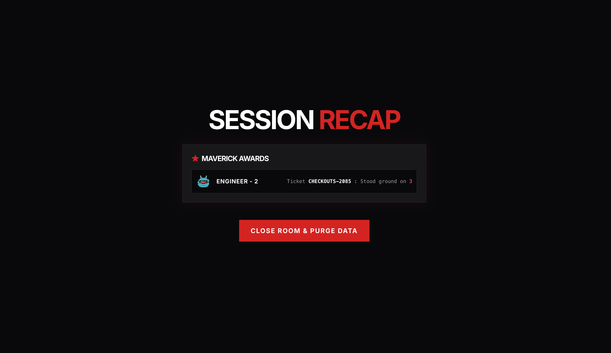

[](https://planning-poker-gamma-rouge.vercel.app/)
[](#)

A high-fidelity, real-time estimation tool designed for high-velocity engineering squads. Built with a "Unified Interface" aesthetic, this application transforms the standard story-pointing ceremony into a fun, data-driven mission briefing.

**Live Application:** [planning-poker-gamma-rouge.vercel.app](https://planning-poker-gamma-rouge.vercel.app/)

---

##  The Mission
In complex technical environments—specifically within the **Payments Team** architecture—precision and consensus are paramount. Current estimation tools (DM in Google meet) lack the "poker" element and "fun factor" required to keep engineers engaged during long refinement sessions.

This project was built to solve the "friction points" of agile ceremonies, providing a seamless bridge between Jira and the team's decision-making process.

### Quality of Life for the Engineering Manager (EM)
Managing a refinement session can be a logistical burden. This tool streamlines the EM's workflow by:
* **Reducing "Group Think":** Blind voting ensures every engineer's voice is heard before the reveal.
* **Facilitating Outlier Discussion:** Automated highlighting of high/low voters focuses the conversation where it matters most.
* **Centralized Record Keeping:** A session-based history log ensures no point value is lost before it reaches the source of truth.

---

## Key Features

### Tactical Identity (Custom Avatars)
Engage the team with custom-selected avatars. Whether it’s tactical agents or team-specific thumbnails, every member has a unique visual presence at the "Virtual Table."

### Estimation & Override
* **Automated Median/Mean:** Instant calculation of the team's consensus as soon as votes are revealed.
* **EM Override:** The Admin can manually override the final story points if the discussion leads to a specific consensus that deviates from the raw average.

### Session History
A sliding history drawer tracks every ticket estimated during the current session.
* *Note: Data is session-persistent and is securely purged when the Admin ends the session.*

### Convenience
Paste any Jira Cloud URL (e.g., `https://riotgames.atlassian.net/browse/RIOTPAY-1234`) directly into the ticket field. We'll parse the Ticket ID, keeping the UI clean and focused.

### The Maverick Award 🏆
At the end of every session, the system analyzes the voting patterns to identify the **Maverick**.
* **Logic:** Awarded to the outlier who initially identified hidden complexity that the rest of the team eventually agreed upon.

---

## Interface Gallery

### Welcome Screen
> 

### The Virtual Table
> 

### Session Recap & Maverick Reveal
> 

---

## Tech Stack
* **Frontend:** React / Tailwind CSS / Framer Motion
* **Database/Real-time:** Firebase Firestore (Live Sync)
* **Deployment:** Vercel (CI/CD)

---

## Future Roadmap: "The Volatile Memory Shift"
While the current version utilizes Firebase for its real-time synchronization, the project's architectural goal is to move toward an even lower-latency, ephemeral state (in-memory data store)

* **In-Memory Caching:** Migration to **Redis (via Upstash)** for sub-10ms state transitions.
* **TTL Architecture:** Automated "Time-To-Live" room expiration, ensuring that ephemeral data never touches permanent disk storage.
* **WebSocket Optimization:** Implementation of Pusher or Ably for high-concurrency event broadcasting.

---

## Installation & Setup

1. **Clone the repository:**
   ```bash
   git clone [https://github.com/your-repo/planning-poker.git](https://github.com/your-repo/planning-poker.git)
   Install dependencies:

2. **Install dependencies:**
    ```bash
   npm install
   
3. **Environment Variables:**
   Create a .env file and add your Firebase configuration:
   ```bash
   VITE_FIREBASE_API_KEY=your_key
   VITE_FIREBASE_AUTH_DOMAIN=your_domain
   VITE_FIREBASE_PROJECT_ID=your_id
4. **Run local server:**
   ```bash
   npm run dev